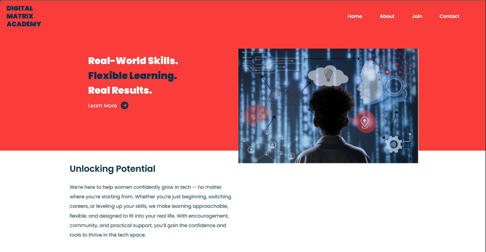
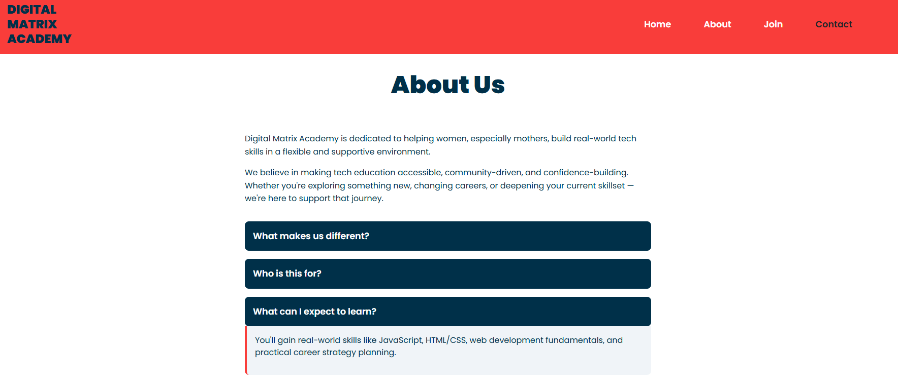
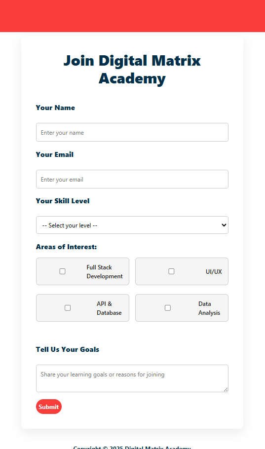
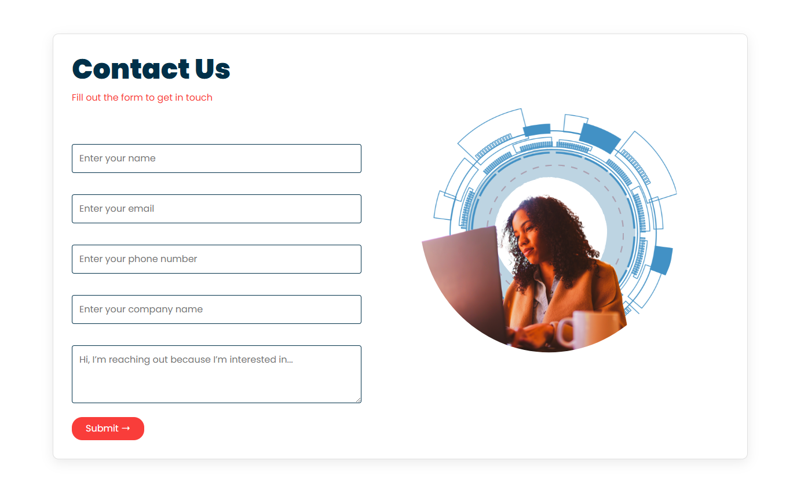
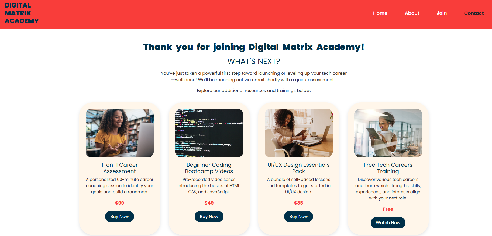

CONTENT REVIEW PORTFOLIO

This project is a design-focused improvement of a basic school website. It was redeveloped as part of my personal portfolio to demonstrate content review, UI enhancement, and basic full-stack functionality using Formspree for form submissions.


UI/UX & DESIGN OVERHAUL

- Rebuilt layout with custom CSS and responsive structure.
- Integrated modern, professional styles using Poppins font.
- Enhanced navigation bar with sticky behavior, hover effects, and active underline indicators.
- Organized content with visual spacing and component modularity.

PAGE RESTRUCTURING

- Added a new homepage layout (HomeLayout.jsx) that includes:
- Hero section
- Scroll-based navigation
- Home content component
### Homepage


## About Us Page

The `AboutUs.jsx` component presents structured content about Digital Matrix Academy’s mission and value proposition. The design utilizes semantic HTML elements and React's `useState` hook to manage an accessible dropdown (accordion) pattern without third-party dependencies.

### Key Implementation Details

- **Component Structure**: Implemented as a functional React component using scoped CSS (`AboutUs.css`) for modular styling.
- **State Management**: A single `useState` hook tracks the currently open dropdown section to ensure a clean and performant toggle behavior.
- **Dropdowns**: Each dropdown is dynamically rendered from a mapped array of content objects, demonstrating DRY principles and scalability for future content updates.
- **Typography & Layout**: Consistent font styles and spacing align with global theming set in `Nav.css` and other shared styles.

### PURPOSE

This page serves to:

- Communicate brand identity and differentiators.
- Enable user interaction via expandable Q&A-style content blocks.
- Reuse global components like `Nav` for layout consistency across routes.

### ABOUT US




- Created a Join Page with a form to collect user data and assess interest level.
### JOIN FORM


Included the Contact Us form on both the Home and About pages for flexibility and accessibility.
### Contact Us


Form Submission (Backend via Formspree)
Integrated Formspree into both Join and Contact Us forms.

Captures user data and sends it via email.

THANK YOU PAGE FEATURES 

After a user submits the Join form, they are redirected to a custom Thank You page that includes:

A confirmation message and next steps to support their tech career journey

A row of pill-style product cards, each featuring:

Image, Title, Description, Pricing, CTA Button (Buy Now or Watch Now)

### Thank You Page


This project is a re-imagined version of a basic school website — now fully responsive and designed with real-world application in mind. From dynamic forms powered by Formspree to modern design updates, it showcases how small changes can turn a simple project into a professional digital experience.

NEXT UP

I plan to add more design elements and user friendly functionalities

- Adding Chatbot
- Building a store with purchasing capability 
- Add videos 


CREDIT

This project is based on the original SchoolWebsite-React created by Dhananjay Sisode.
Design updates, form enhancements using Formspree, and additional page components were added to fit the mission and branding of Digital Matrix Academy.

ORIGINAL PROJECT

https://github.com/DhananjaySisode/SchoolWebsite-React/tree/main/client/src 

## Getting Started

### Prerequisites
- Node.js and npm installed

### Installation
1. Clone the repository:
   ```bash
   git clone https://github.com/ChristinaJayH/digital-matrix-academy.git
   cd digital-matrix-academy/client

 ```bash
   npm install
   npm start

